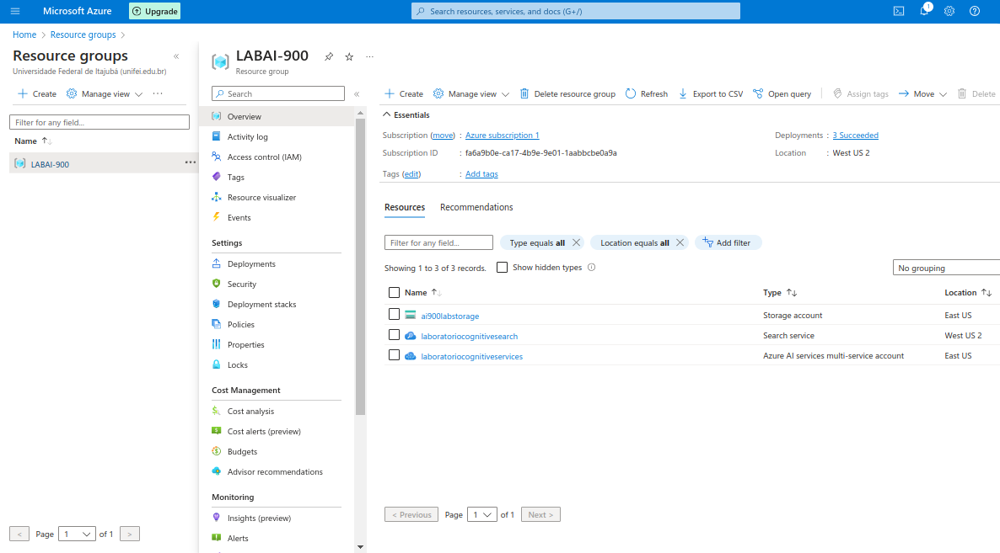
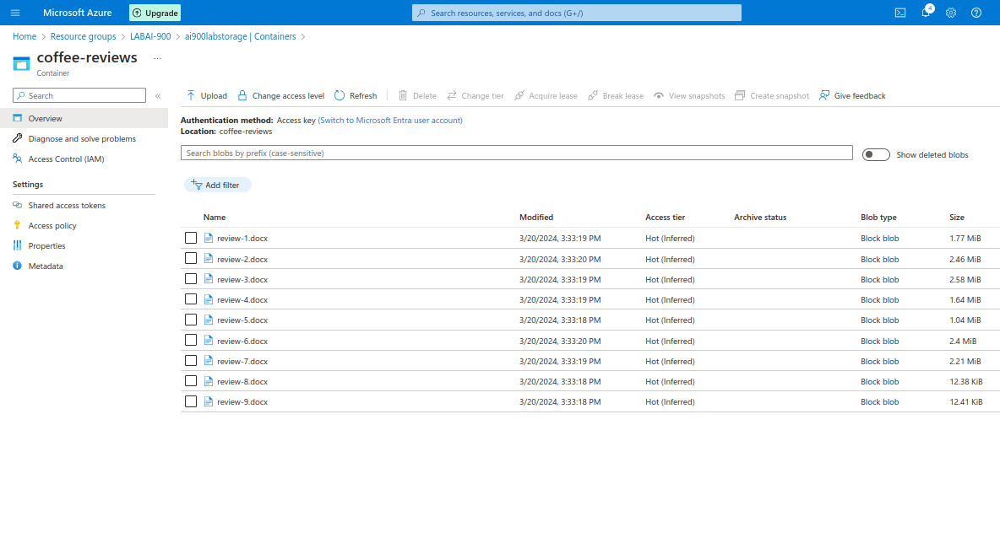
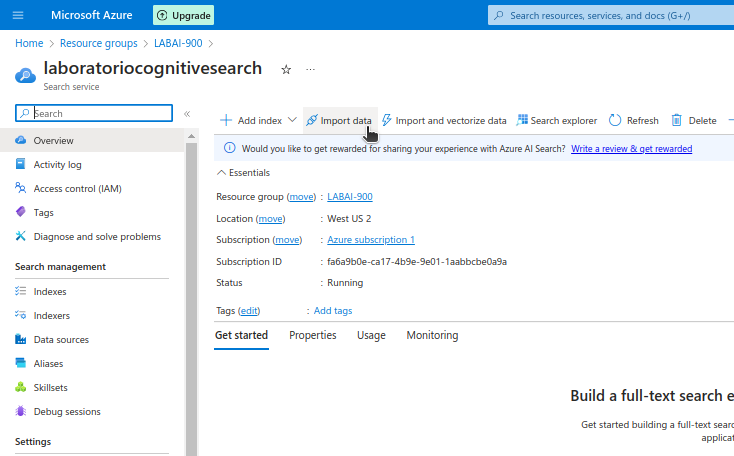
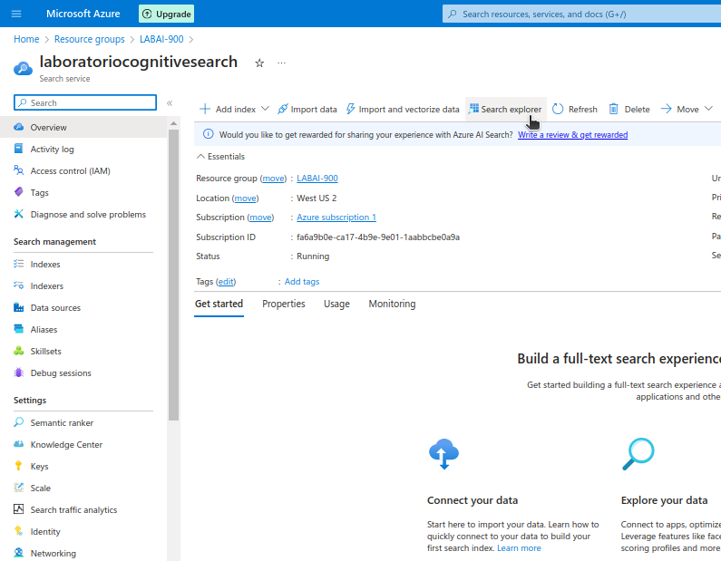
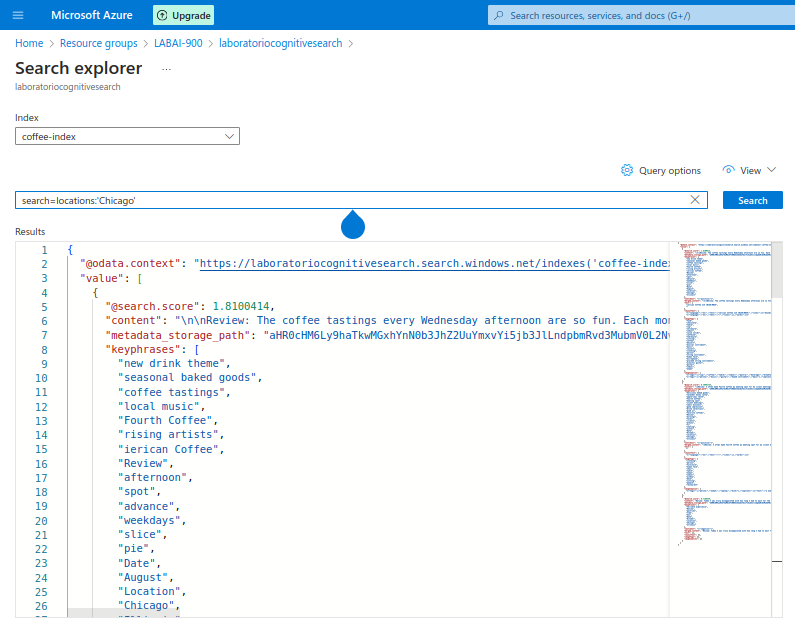
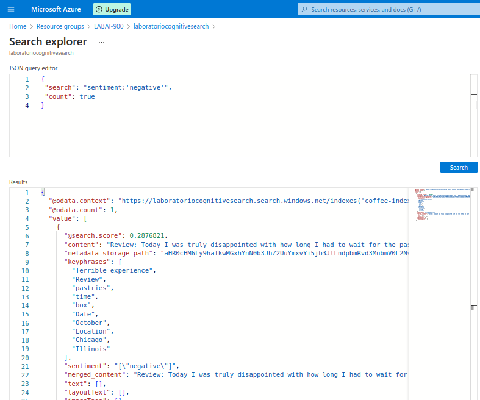

# Lab Project 04 - Azure Cognitive Search: Aplicando AI Search para Indexação e Consulta de Dados

## Introdução

Este laboratório tem como foco explorar ferramentas de indexação, pesquisa e document intelligence utilizando o recurso Azure AI Search. As atividades aqui descritas foram realizadas no contexto do Bootcamp Microsoft Azure AI Fundamentals, promovido pela DIO.

Neste repositório, utilizo técnicas de Document Intelligence para desenvolver uma solução de mineração de conhecimento, com o objetivo de obter insights a partir de avaliações de clientes de uma cafeteria fictícia. Para isso, foi construído um índice do Azure AI Search com base nessas avaliações.

Os testes foram baseados nos tutoriais do Microsoft Learn. Para mais detalhes, acesse o guia Explore an Azure AI Search index (UI).

## Procedimento

Para colocar em prática a análise com Document Intelligence, são necessários três recursos do Azure: Azure AI Search, Azure AI Services e Storage Account.

  

    Azure AI Search: responsável por indexar e realizar buscas nos documentos.

    Azure AI Services: fornece as capacidades de inteligência artificial que enriquecem os dados analisados.

    Storage Account: local onde os documentos ficam armazenados, dentro de blob containers.

### Upload dos Arquivos e Criação do Índice

As avaliações de clientes utilizadas neste projeto podem ser acessadas neste link. Após configurar o container de armazenamento, os arquivos foram enviados para lá.

  

Com os arquivos no armazenamento, foi possível iniciar o processo de criação de um index no Azure AI Search e, a partir disso, começar a extrair informações relevantes. Esse processo é facilitado por um assistente no próprio portal do Azure.

  

Durante essa configuração, é fundamental escolher corretamente o storage que contém os documentos e definir as skills que serão aplicadas para enriquecer os dados. Há uma variedade de skills disponíveis, e a seleção adequada depende do conteúdo que será analisado.

### Realizando Pesquisas no Índice

O Azure AI Search oferece uma interface amigável para realizar consultas no índice criado. Os resultados das pesquisas são retornados no formato JSON.

  

A imagem abaixo ilustra uma consulta simples, que retorna avaliações de clientes da cidade de Chicago.

  

Também é possível filtrar os resultados com base no sentimento das avaliações, por exemplo, exibindo apenas aquelas com sentimento negativo, conforme a análise automatizada do conteúdo.

  

Outro recurso interessante são as keyphrases (frases-chave) extraídas automaticamente. Essas palavras ou trechos destacam os principais temas de cada avaliação e ajudam a entender rapidamente o conteúdo analisado, mesmo sem ler todo o texto.

### Conclusão e Insights

Vivemos em um momento onde a quantidade de dados disponíveis cresce constantemente — e mais importante do que ter acesso a essa informação é saber analisá-la. É nesse cenário que as soluções de Document Intelligence ganham destaque. Elas permitem transformar grandes volumes de dados em algo compreensível e valioso. Ao aplicar essas ferramentas, empresas conseguem obter insights estratégicos que seriam inviáveis de identificar manualmente, tornando a análise de dados um diferencial competitivo essencial.